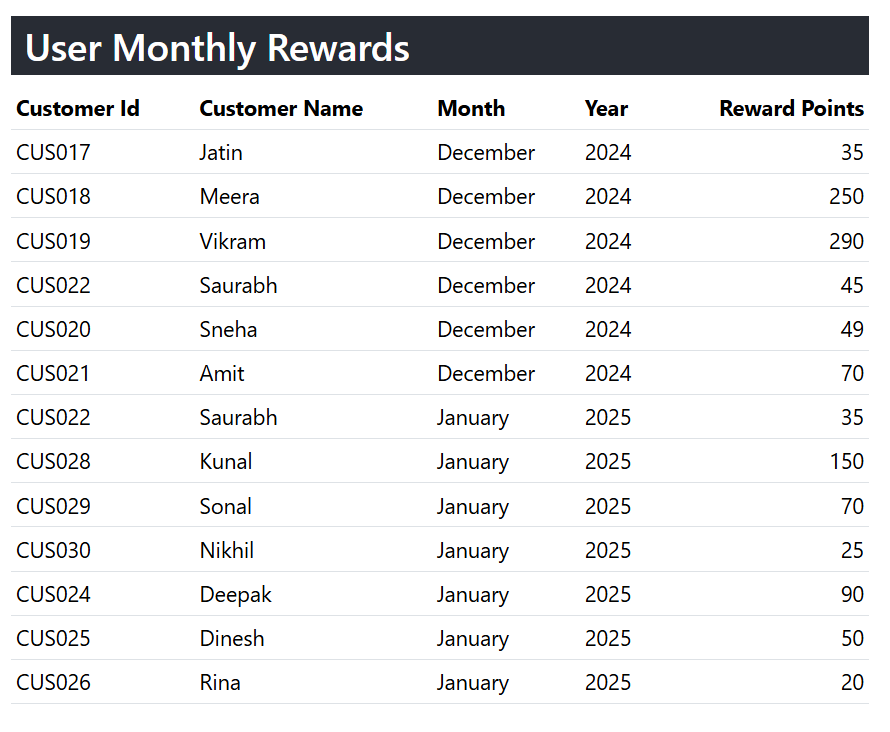
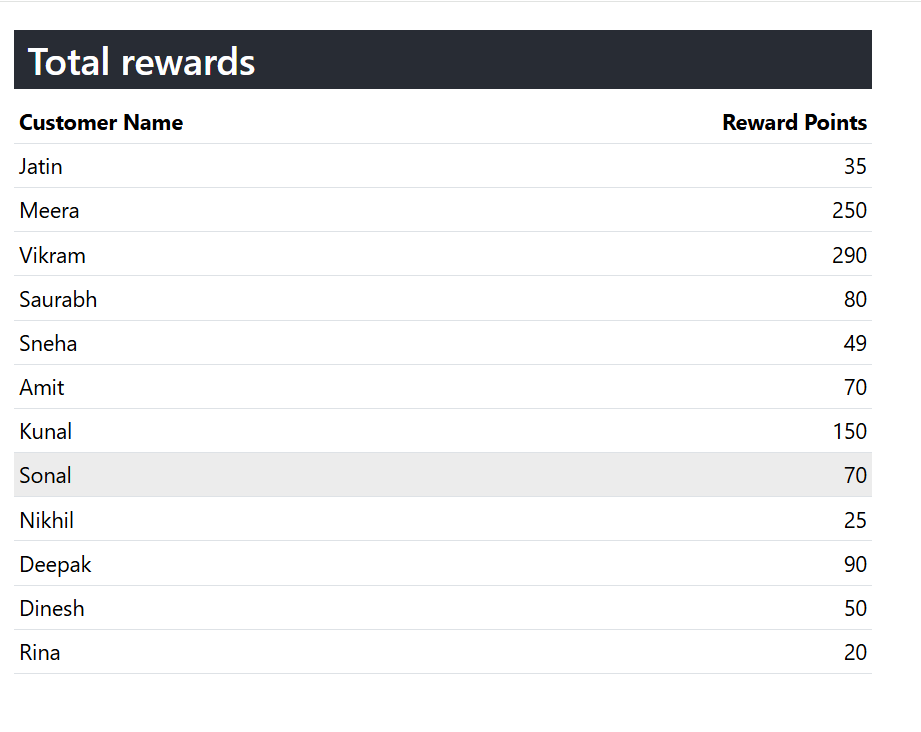
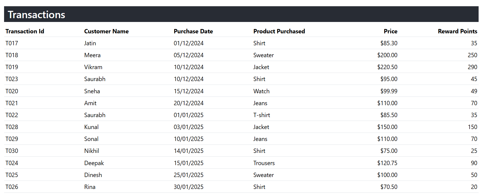

# Transactions Rewards System

This is a React-based project that tracks and displays customer transaction data, calculates reward points, and aggregates them by month, year and customer. The system supports the display of transaction details, total reward points per customer, and monthly aggregated rewards.

## Features

- Display individual transactions with details (Transaction ID, Customer Name, Purchase Date, etc.).
- Calculate reward points based on price thresholds.
- Display total reward points per customer.
- Display aggregated reward points by month and year.
- Filter transactions based on price and date range (e.g., last 3 months).

### `npm install`
To install all required packages

### `npm start`
Runs the app in the development mode.\
Open [http://localhost:3000](http://localhost:3000) to view it in your browser.

src/services/fetchData.js  which contains fetch json data from public/data.json
Rewards points calculation logic is in src/utils/util.js

src/pages/TransactionsPage.js 
In this page we are doing all calculations and send values to components as props
And this main page is imported in App.js

### Under src/components folder below are the components
MonthlyRewards.js component contains users monthly rewards
This table contains for each custmer id Total Rewards for each month, from latest three months
This is aggregate rewards of each customers in unique month-year

TotalRewards.js component contains Total Reward Points per user
This table contains Total rewards of each unique customer id,  from latest three months

Transactions.js component contains All transactions with reward points
This table contans latest three months transactions and their reward points

### `npm test`
